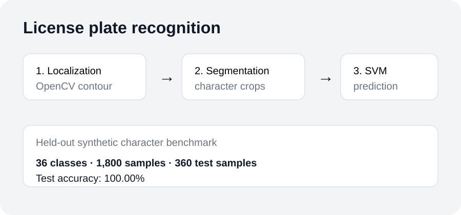

# License Plate Recognition with Machine Learning

A classic Automatic License Plate Recognition (ALPR) pipeline in Python. The project localizes a plate, segments its characters, and recognizes each character with an RBF-kernel SVM.

## Demo



## Problem statement

Reading a license plate from a vehicle image requires more than character recognition. The system first needs to locate the plate, isolate its characters, and classify those character images despite noise and variation.

The pipeline is:

1. **Localization**: grayscale conversion, denoising, Canny edges, morphology, contour selection, and perspective correction.
2. **Segmentation**: adaptive thresholding and connected-component filtering.
3. **Recognition**: 20×20 character images classified with an RBF SVM.

## Test-set results

A reproducible evaluation script creates a deterministic synthetic dataset covering **36 classes (A-Z and 0-9)** and uses a stratified **80/20 train-test split**.

With `--per-char 50`:

| Metric | Result |
| --- | ---: |
| Classes | 36 |
| Total samples | 1,800 |
| Training samples | 1,440 |
| Test samples | 360 |
| Test accuracy | **100.00%** |

Run it yourself:

```bash
pip install -r requirements.txt
python evaluate_character_model.py --per-char 50
```

**Important scope:** 100% is the held-out accuracy for this synthetic character-classification benchmark. It is **not** a claim of 100% real-world vehicle-level plate recognition. Real-world performance depends on localization, lighting, camera angle, plate/font variation, image quality, and training data.

## Installation

```bash
pip install -r requirements.txt
```

## Getting started

### 1. Generate training data

```bash
python generate_training_data.py --per-char 20 --out train_data
```

### 2. Train the recognizer

```bash
python -m lpr.cli train train_data
```

### 3. Recognize a plate

```bash
python -m lpr.cli detect path/to/car.jpg
```

Add `--show` to display the detected plate contour.

## Project structure

```
license-plate-recognition/
├── lpr/
├── generate_training_data.py
├── evaluate_character_model.py
├── docs/
│   └── lpr-demo.svg
├── requirements.txt
└── README.md
```

## Limitations and next steps

- The benchmark uses synthetic characters, so it does not represent real traffic conditions.
- Plate localization can fail on complex backgrounds or unusual viewpoints.
- Character segmentation can fail when characters touch or the plate is heavily distorted.
- The next useful evaluation is a real labeled plate dataset with character-level and full-plate accuracy reported separately.

## License

MIT
